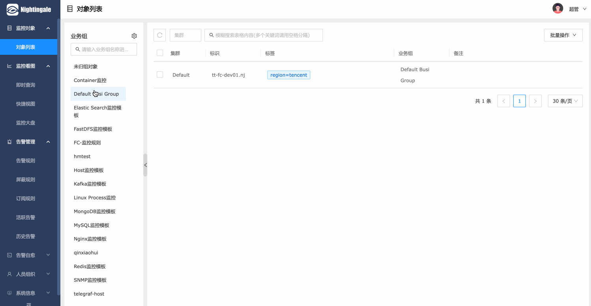
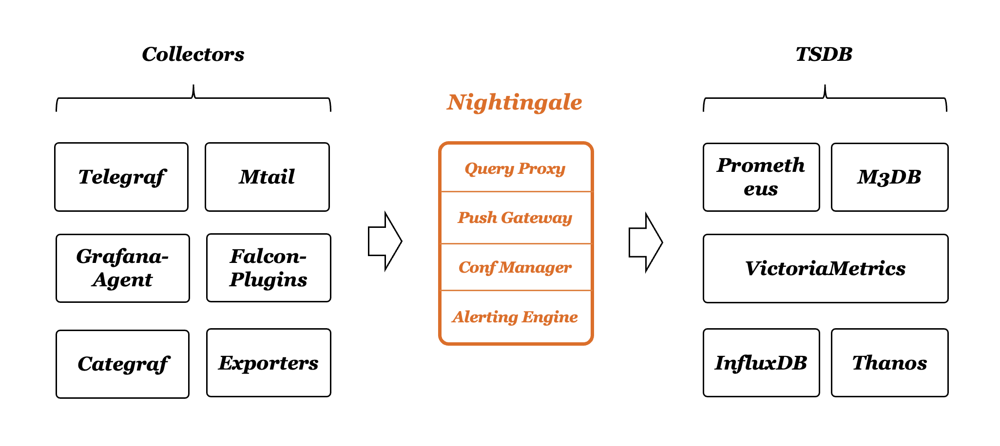
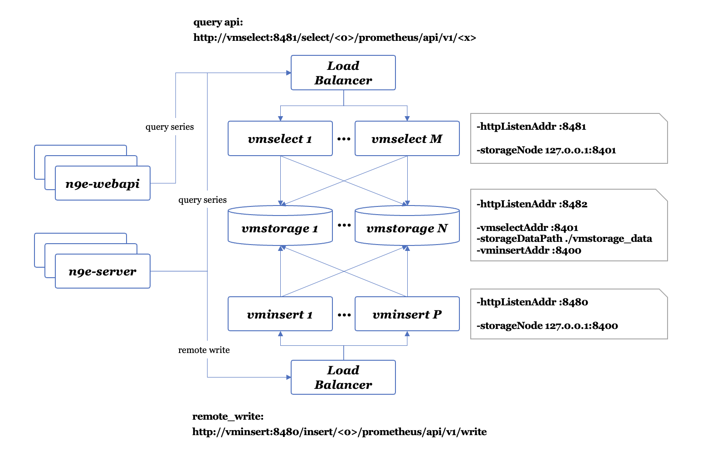

  
  
夜莺是一款开源的云原生监控系统，采用 all-in-one 的设计，提供企业级的功能特性，开箱即用的产品体验。推荐升级您的 Prometheus + AlertManager + Grafana 组合方案到夜莺

[English](./README_EN.md) | [中文](./README.md)

## Highlighted Features

- **开箱即用**
  - 支持 Docker、Helm Chart、云服务等多种部署方式，集数据采集、监控告警、可视化为一体，内置多种监控仪表盘、快捷视图、告警规则模板，导入即可快速使用，**大幅降低云原生监控系统的建设成本、学习成本、使用成本**；
- **专业告警**
  - 可视化的告警配置和管理，支持丰富的告警规则，提供屏蔽规则、订阅规则的配置能力，支持告警多种送达渠道，支持告警自愈、告警事件管理等；
- **云原生**
  - 以交钥匙的方式快速构建企业级的云原生监控体系，支持 [**Categraf**](https://github.com/flashcatcloud/categraf)、Telegraf、Grafana-agent 等多种采集器，支持 Prometheus、VictoriaMetrics、M3DB、ElasticSearch 等多种数据库，兼容支持导入 Grafana 仪表盘，**与云原生生态无缝集成**；
- **高性能，高可用**
  - 得益于夜莺的多数据源管理引擎，和夜莺引擎侧优秀的架构设计，借助于高性能时序库，可以满足数亿时间线的采集、存储、告警分析场景，节省大量成本；
  - 夜莺监控组件均可水平扩展，无单点，已在上千家企业部署落地，经受了严苛的生产实践检验。众多互联网头部公司，夜莺集群机器达百台，处理数亿级时间线，重度使用夜莺监控；
- **灵活扩展，中心化管理**
  - 夜莺监控，可部署在 1 核 1G 的云主机，可在上百台机器集群化部署，可运行在 K8s 中；也可将时序库、告警引擎等组件下沉到各机房、各 Region，兼顾边缘部署和中心化统一管理，**解决数据割裂，缺乏统一视图的难题**；
- **开放社区**
  - 托管于[中国计算机学会开源发展委员会](https://www.ccf.org.cn/kyfzwyh/)，有[**快猫星云**](https://flashcat.cloud)和众多公司的持续投入，和数千名社区用户的积极参与，以及夜莺监控项目清晰明确的定位，都保证了夜莺开源社区健康、长久的发展。活跃、专业的社区用户也在持续迭代和沉淀更多的最佳实践于产品中；

> 如果您在使用 Prometheus 过程中，有以下的一个或者多个需求场景，推荐您无缝升级到夜莺：

- Prometheus、Alertmanager、Grafana 等多个系统较为割裂，缺乏统一视图，无法开箱即用;
- 通过修改配置文件来管理 Prometheus、Alertmanager 的方式，学习曲线大，协同有难度;
- 数据量过大而无法扩展您的 Prometheus 集群；
- 生产环境运行多套 Prometheus 集群，面临管理和使用成本高的问题；

> 如果您在使用 Zabbix，有以下的场景，推荐您升级到夜莺：

- 监控的数据量太大，希望有更好的扩展解决方案；
- 学习曲线高，多人多团队模式下，希望有更好的协同使用效率；
- 微服务和云原生架构下，监控数据的生命周期多变、监控数据维度基数高，Zabbix 数据模型不易适配；

> 如果您在使用 [Open-Falcon](https://github.com/open-falcon/falcon-plus)，我们更推荐您升级到夜莺：

- 关于 Open-Falcon 和夜莺的详细介绍，请参考阅读：[云原生监控的十个特点和趋势](https://mp.weixin.qq.com/s?__biz=MzkzNjI5OTM5Nw==&mid=2247483738&idx=1&sn=e8bdbb974a2cd003c1abcc2b5405dd18&chksm=c2a19fb0f5d616a63185cd79277a79a6b80118ef2185890d0683d2bb20451bd9303c78d083c5#rd)。

> 我们推荐您使用 [Categraf](https://github.com/flashcatcloud/categraf) 作为首选的监控数据采集器：

- [Categraf](https://github.com/flashcatcloud/categraf) 是夜莺监控的默认采集器，采用开放插件机制和 all-in-one 的设计，同时支持 metric、log、trace、event 的采集。Categraf 不仅可以采集 CPU、内存、网络等系统层面的指标，也集成了众多开源组件的采集能力，支持K8s生态。Categraf 内置了对应的仪表盘和告警规则，开箱即用。
 

## Getting Started

- [国外文档](https://n9e.github.io/)
- [国内文档](http://n9e.flashcat.cloud/)

## Screenshots

## Architecture

夜莺监控可以接收各种采集器上报的监控数据（比如 [Categraf](https://github.com/flashcatcloud/categraf)、telegraf、grafana-agent、Prometheus），并写入多种流行的时序数据库中（可以支持Prometheus、M3DB、VictoriaMetrics、Thanos、TDEngine等），提供告警规则、屏蔽规则、订阅规则的配置能力，提供监控数据的查看能力，提供告警自愈机制（告警触发之后自动回调某个webhook地址或者执行某个脚本），提供历史告警事件的存储管理、分组查看的能力。

夜莺 v5 版本的设计非常简单，核心是 server 和 webapi 两个模块，webapi 无状态，放到中心端，承接前端请求，将用户配置写入数据库；server 是告警引擎和数据转发模块，一般随着时序库走，一个时序库就对应一套 server，每套 server 可以只用一个实例，也可以多个实例组成集群，server 可以接收 Categraf、Telegraf、Grafana-Agent、Datadog-Agent、Falcon-Plugins 上报的数据，写入后端时序库，周期性从数据库同步告警规则，然后查询时序库做告警判断。每套 server 依赖一个 redis。

如果单机版本的时序数据库（比如 Prometheus） 性能有瓶颈或容灾较差，我们推荐使用 [VictoriaMetrics](https://github.com/VictoriaMetrics/VictoriaMetrics)，VictoriaMetrics 架构较为简单，性能优异，易于部署和运维，架构图如上。VictoriaMetrics 更详尽的文档，还请参考其[官网](https://victoriametrics.com/)。

## Community

开源项目要更有生命力，离不开开放的治理架构和源源不断的开发者和用户共同参与，我们致力于建立开放、中立的开源治理架构，吸纳更多来自企业、高校等各方面对云原生监控感兴趣、有热情的开发者，一起打造有活力的夜莺开源社区。关于《夜莺开源项目和社区治理架构（草案）》，请查阅 [COMMUNITY GOVERNANCE](./doc/community-governance.md).

**我们欢迎您以各种方式参与到夜莺开源项目和开源社区中来，工作包括不限于**：
- 补充和完善文档 => [n9e.github.io](https://n9e.github.io/)
- 分享您在使用夜莺监控过程中的最佳实践和经验心得 => [文章分享](https://n9e.github.io/docs/prologue/share/)
- 提交产品建议 =》 [github issue](https://github.com/ccfos/nightingale/issues/new?assignees=&labels=kind%2Ffeature&template=enhancement.md)
- 提交代码，让夜莺监控更快、更稳、更好用 => [github pull request](https://github.com/didi/nightingale/pulls)

**尊重、认可和记录每一位贡献者的工作**是夜莺开源社区的第一指导原则，我们提倡**高效的提问**，这既是对开发者时间的尊重，也是对整个社区知识沉淀的贡献：
- 提问之前请先查阅 [FAQ](https://www.gitlink.org.cn/ccfos/nightingale/wiki/faq) 
- 我们使用[GitHub Discussions](https://github.com/ccfos/nightingale/discussions)作为交流论坛，有问题可以到这里搜索、提问
- 我们也推荐你加入微信群，和其他夜莺用户交流经验 (请先加好友：[UlricGO](https://www.gitlink.org.cn/UlricQin/gist/tree/master/self.jpeg) 备注：夜莺加群+姓名+公司)

## Who is using

您可以通过在 **[Who is Using Nightingale](https://github.com/ccfos/nightingale/issues/897)** 登记您的使用情况，分享您的使用经验。

## Stargazers

## Contributors

## License
[Apache License V2.0](https://github.com/didi/nightingale/blob/main/LICENSE)

## Contact Us
推荐您关注夜莺监控公众号，及时获取相关产品和社区动态：

