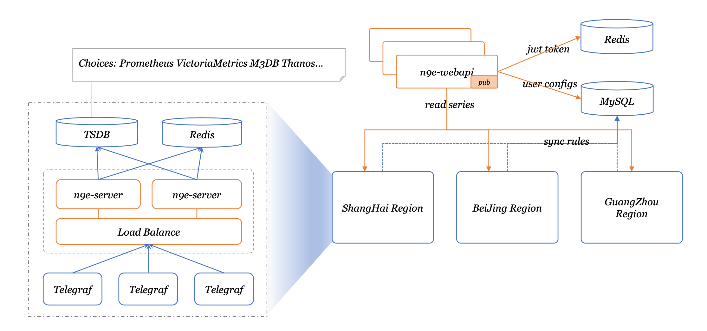

## Introduction

Nightingale is an enterprise-level cloud-native monitoring system, which can be used as drop-in replacement of Prometheus for alerting and management.

## Architecture

## Docs

[https://n9e.github.io/](https://n9e.github.io/)

## TODO

- [x] deploy nightingale in docker
- [x] export /metrics endpoint
- [x] notify.py support feishu
- [ ] notify.py support sms
- [ ] notify.py support voice
- [x] support remote write api
- [ ] support pushgateway api

## Any questions?

[Click me](https://s3-gz01.didistatic.com/n9e-pub/image/n9e-wx.png)
