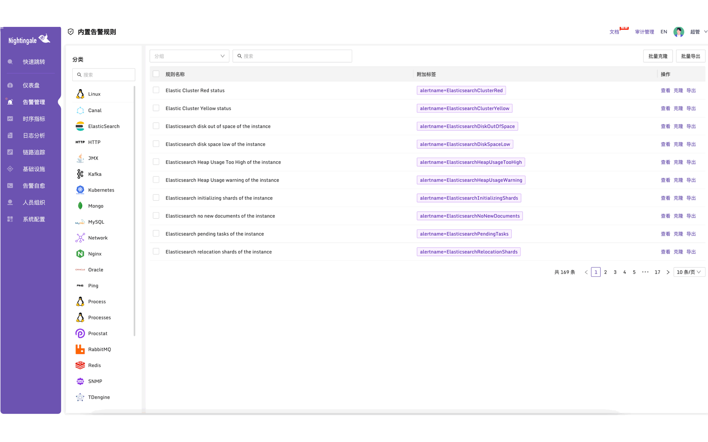
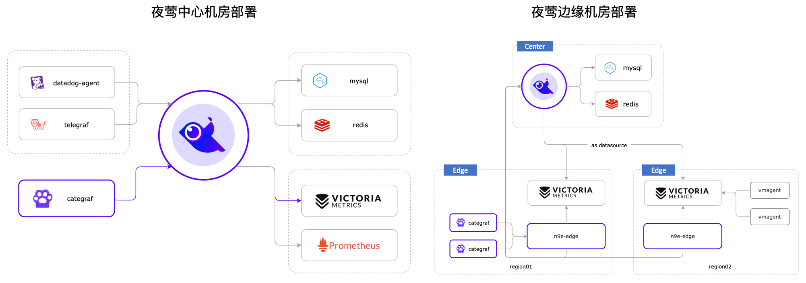

  

 

  告警管理专家，一体化的开源可观测平台

[English](./README_en.md) | [中文](./README.md)

夜莺Nightingale是中国计算机学会托管的开源云原生可观测工具，最早由滴滴于 2020 年孵化并开源，并于 2022 年正式捐赠予中国计算机学会。夜莺采用 All-in-One 的设计理念，集数据采集、可视化、监控告警、数据分析于一体，与云原生生态紧密集成，融入了顶级互联网公司可观测性最佳实践，沉淀了众多社区专家经验，开箱即用。

## 资料

- 文档：[flashcat.cloud/docs](https://flashcat.cloud/docs/)
- 提问：[answer.flashcat.cloud](https://answer.flashcat.cloud/)
- 报Bug：[github.com/ccfos/nightingale/issues](https://github.com/ccfos/nightingale/issues/new?assignees=&labels=kind%2Fbug&projects=&template=bug_report.yml)

## 功能和特点

- 统一接入各种时序库：支持对接 Prometheus、VictoriaMetrics、Thanos、Mimir、M3DB 等多种时序库，实现统一告警管理
- 专业告警能力：内置支持多种告警规则，可以扩展支持所有通知媒介，支持告警屏蔽、告警抑制、告警自愈、告警事件管理
- 高性能可视化引擎：支持多种图表样式，内置众多Dashboard模版，也可导入Grafana模版，开箱即用，开源协议商业友好
- 无缝搭配 [Flashduty](https://flashcat.cloud/product/flashcat-duty/)：实现告警聚合收敛、认领、升级、排班、IM集成，确保告警处理不遗漏，减少打扰，更好协同
- 支持所有常见采集器：支持 [Categraf](https://flashcat.cloud/product/categraf)、telegraf、grafana-agent、datadog-agent、各种 exporter 作为采集器，没有什么数据是不能监控的
- 一体化观测平台：从 v6 版本开始，支持接入 ElasticSearch、Jaeger 数据源，实现日志、链路、指标多维度的统一可观测

## 产品演示

## 部署架构

## 加入交流群

欢迎加入 QQ 交流群，群号：479290895，QQ 群适合群友互助，夜莺研发人员通常不在群里。如果要报 bug 请到[这里](https://github.com/ccfos/nightingale/issues/new?assignees=&labels=kind%2Fbug&projects=&template=bug_report.yml)，提问到[这里](https://answer.flashcat.cloud/)。

## Stargazers over time

## Contributors

## 社区治理
[夜莺开源项目和社区治理架构（草案）](./doc/community-governance.md)

## License
[Apache License V2.0](https://github.com/didi/nightingale/blob/main/LICENSE)