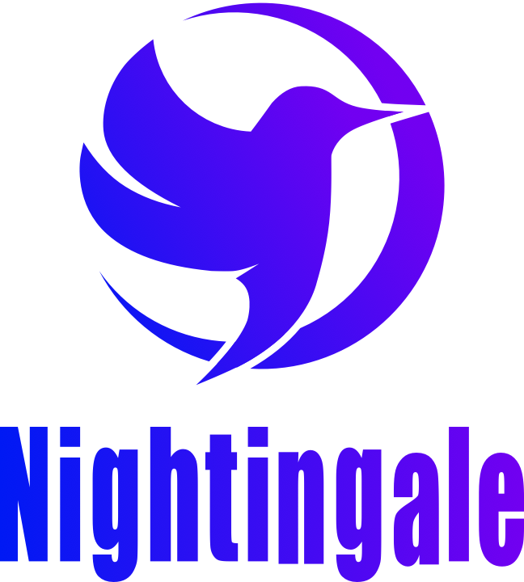
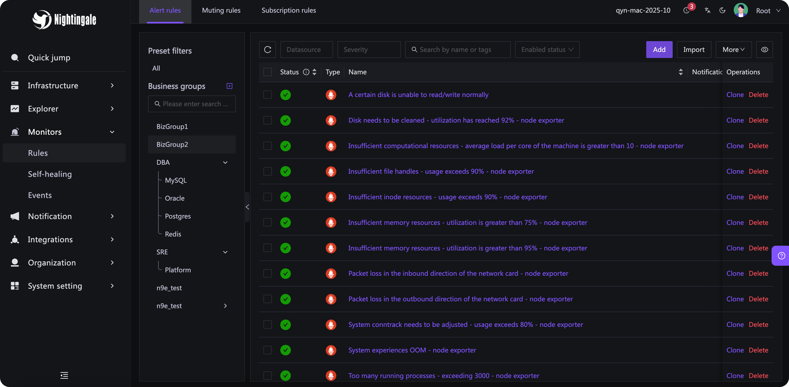

<p align="center">
  <a href="https://github.com/ccfos/nightingale">
    
  </a>
</p>

<p align="center">
  <b>Open-source alerting for your existing stack</b>
</p>

<p align="center">
  <a href="https://github.com/ccfos/nightingale/releases"></a>
  <a href="LICENSE"></a>
  <a href="https://github.com/ccfos/nightingale/stargazers"></a>
  <a href="https://hub.docker.com/r/flashcatcloud/nightingale"></a>
  <a href="https://join.slack.com/t/n9e/shared_invite/zt-480klxytf-P9qm3C1M87kDmRPp_H30Kw"></a>
</p>

<p align="center">
  <a href="#quick-start">Quick start</a> ·
  <a href="https://n9e.github.io/">Documentation</a> ·
  <a href="https://github.com/ccfos/nightingale/releases">Releases</a> ·
  <a href="#community">Community</a>
</p>

[English](README.md) | [中文](README_zh.md)

Nightingale brings alert rules, event processing, and notification routing into one place. Connect Prometheus, VictoriaMetrics, Elasticsearch, Loki, ClickHouse, and other data sources you already run, then deliver alerts to Slack, PagerDuty, and your team's existing tools.

**Self-hosted · Apache-2.0 · Built-in AI agent · MCP server**


## Why Nightingale?

- **Give teams ownership of their alerts.** Organize rules into business groups, assign team permissions, and manage rules and notification settings through the UI and API.
- **Bring scattered alerting into one place.** Evaluate rules against metrics, logs, and SQL data sources while keeping your existing collectors, storage, and Grafana dashboards.
- **Understand what happened to an alert.** Inspect rule evaluation records, historical events, and notification results to trace a query through to delivery.

## Quick start

With Git and Docker Compose installed, start the included evaluation stack:

```bash
git clone https://github.com/ccfos/nightingale.git
cd nightingale/docker/compose-bridge
docker compose up -d
```

This starts Nightingale, MySQL, Redis, VictoriaMetrics, and Categraf. Open [http://localhost:17000](http://localhost:17000) and sign in with **`root` / `root.2020`**.

To get your first alert:

1. **Connect a data source.** Add your existing Prometheus-compatible endpoint, or use `http://victoriametrics:8428` for the VictoriaMetrics instance in this Compose stack.
2. **Create an alert rule.** Choose a business group and data source, then enter a PromQL expression. For an always-firing test, use `vector(1) > 0` and set the duration to `0`.
3. **Configure delivery.** Set up a notification channel, create a notification rule, and attach it to the alert rule. Check that the test notification arrives, then disable the test alert.

The Compose stack uses example credentials and exposes service ports for local evaluation. Change credentials and review network access before deploying on a shared or public host. See [deployment options](#deployment) for other ways to run Nightingale.

## How it fits into your stack

Nightingale queries your data sources, evaluates alert conditions, processes events, and routes notifications. Your existing data stays in its current stores.

Keep Grafana for visualization and your on-call platform for scheduling, escalation, and incident response. Nightingale also includes dashboards for teams that want to explore data alongside their alerts.

Starting without a monitoring stack? The standalone configuration includes an optional embedded TSDB for small, single-instance deployments. [Categraf](https://github.com/flashcatcloud/categraf) is an optional collector for hosts, middleware, databases, and network devices.

## Key capabilities

| Capability | What you can do |
| --- | --- |
| Alerting across data sources | Use PromQL, log queries, or SQL to define conditions. Apply a rule to multiple instances of the same data source type. |
| Team ownership | Group rules and dashboards by business group, assign team permissions, and connect OIDC, OAuth2, LDAP, or CAS for sign-in. |
| Event processing and routing | Mute notifications, subscribe to alerts, enrich or rewrite labels, and route events through conditional pipelines. |
| Alert execution records | Review evaluation queries and results, active and historical events, and notification delivery records. |
| Reusable integrations | Start with bundled collector configurations, alert rules, and dashboards. Review queries and thresholds for your environment before enabling them. |
| Distributed evaluation | Distribute rules across alerting engines and use `n9e-edge` to evaluate alerts close to remote data sources. |

Notification integrations include **Slack, PagerDuty, Discord, Email, Telegram, Mattermost, Jira, and Jira Service Management**, with HTTP webhooks and scripts for custom destinations. See the [native notification channel reference](doc/api/notify-channel-native.md) for configuration details.

For automated responses, connect [ibex](https://github.com/flashcatcloud/ibex) to run predefined remediation scripts when an alert fires.

<a id="-mcp-server"></a>
<a id="ai-assistant-and-mcp"></a>

## Built-in AI agent

Nightingale includes an AI agent you can use directly in the web UI. The agent runs inside Nightingale, calls tools to inspect your monitoring data and configuration, and works through tasks over multiple steps.

- **Investigate alerts.** Query related metrics and logs, inspect affected hosts, and explain findings using the data it retrieves.
- **Troubleshoot the alerting process.** Inspect rules, evaluation logs, mute settings, event processing, and notification results to find why an alert did not fire or reach its destination.
- **Create and update configuration.** Build alert rules and dashboards, generate PromQL and SQL, and configure notification rules, mutes, and subscriptions through conversation. The built-in tools for updating existing alert rules and dashboards present proposed changes for confirmation.
- **Extend it with Skills.** Bundled Skills cover common monitoring workflows. Add your team's procedures, reference material, and scripts as custom Skills, including Skills imported from Git.

For example:

> Why did this alert fire? Check the affected host's metrics and logs around the trigger time.

> Create a memory-usage alert for the production hosts and notify our team in Slack.

Configure a model endpoint to get started. The agent supports OpenAI-compatible APIs, Claude, Gemini, and compatible self-hosted models. You choose the model service and credentials; core alerting works independently of the agent.

[Model provider configuration](doc/api/ai-llm-config.md) · [Skill management](doc/api/ai-skill.md) · [Bundled Skills](aiagent/skill/embedded/builtin)

### Connect external agents

- **MCP** lets external assistants call Nightingale's tools. The server runs inside Nightingale at `/mcp`, exposes read tools by default, and applies the caller's existing API permissions. Write tools require explicit configuration. See [MCP setup](doc/api/mcp-server.md).
- **A2A** lets another agent delegate a task to Nightingale's built-in agent. See [A2A integration](doc/api/a2a-integration.md).

## Product screenshots

Manage alert rules by data source and business group:



## Deployment

| Option | Start here |
| --- | --- |
| Local evaluation with Docker Compose | [Included Compose stack](docker/compose-bridge/docker-compose.yaml) |
| Linux binaries for amd64 and arm64 | [Release downloads](https://github.com/ccfos/nightingale/releases) and [configuration reference](etc/config.toml) |
| Kubernetes | [Helm chart and installation instructions](https://github.com/flashcatcloud/n9e-helm) |

For production, pin a release, configure credentials and TLS, back up the metadata database, and monitor rule evaluation and notification failures. Multiple Nightingale instances share a metadata database and Redis; use external time-series storage for a multi-instance deployment. The embedded TSDB stores data on one instance's local disk.

See the [documentation](https://n9e.github.io/), [release notes](https://github.com/ccfos/nightingale/releases), and [security policy](SECURITY.md) for further guidance and supported versions.

## FAQ

**Do I need to replace my collectors or move my monitoring data?**

No. Nightingale can query your existing data sources directly. Keep your exporters and collectors. Categraf and the embedded TSDB are available when you need collection or local storage.

**Can I import existing Prometheus alert rules?**

Yes. The rule import supports Prometheus YAML, including expressions, durations, labels, and annotations. Review the converted rules and rebuild notification routing in Nightingale. Import is not a complete conversion of `alertmanager.yml`; run both systems during evaluation before switching notifications over.

**Can I manage rules through Git and CI?**

Rules can be exported as JSON and created or updated through the HTTP API, so you can build a workflow around version-controlled configuration. Nightingale does not currently provide built-in rule revision history or rollback to earlier revisions.

**Is AI required, and where do model requests go?**

Alerting works without AI. The built-in assistant sends prompts and the data it uses to your configured model endpoint; you can use a model hosted in your own network. External MCP clients use their own model settings. Model service credentials and usage costs are managed by you.

**Does Nightingale provide on-call scheduling and escalation?**

Connect an on-call platform such as PagerDuty for schedules, escalation policies, and incident response. Nightingale handles rule evaluation, event processing, and notification routing.

## Community

Questions, bug reports, documentation improvements, and contributions are welcome in English.

- [GitHub Discussions](https://github.com/ccfos/nightingale/discussions) — ask questions and share ideas.
- [GitHub Issues](https://github.com/ccfos/nightingale/issues) — report bugs and request features. Include the version, deployment method, and steps to reproduce.
- [Slack](https://join.slack.com/t/n9e/shared_invite/zt-480klxytf-P9qm3C1M87kDmRPp_H30Kw) — join the community.
- [Adopter reports](https://github.com/ccfos/nightingale/issues/897) — see how others use Nightingale and share your own experience.
- [Security policy](SECURITY.md) — report vulnerabilities privately and check version support.

For substantial changes, open an issue to discuss the approach before submitting a pull request. Please follow the [Code of Conduct](CODE_OF_CONDUCT.md).

Nightingale was originally developed at DiDi and donated to CCF ODC in 2022. Learn about [project governance](doc/community-governance.md), [committers](doc/committers.md), and [contributors](https://github.com/ccfos/nightingale/graphs/contributors).

<a href="https://github.com/ccfos/nightingale/graphs/contributors">
  
</a>

## Stargazers over time

[](https://star-history.dera.page/#ccfos/nightingale&Date)

## License

Nightingale is available under the [Apache License 2.0](LICENSE).


