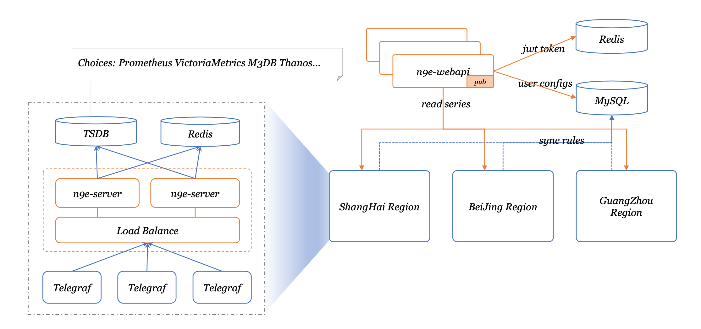

 Nightingale is an enterprise-level cloud-native monitoring system, which can be used as drop-in replacement of Prometheus for alerting and management.   

[English](./README_EN.md) | [中文](./README.md)

## Introduction
Nightingale is an cloud-native monitoring system by All-In-On design, support enterprise-class functional features with an out-of-the-box experience. We recommend upgrading your `Prometheus` + `AlertManager` + `Grafana` combo solution to Nightingale.

- **Multiple prometheus data sources management**: manage all alerts and dashboards in one centralized visually view;
- **Out-of-the-box alert rule**: built-in multiple alert rules, reuse alert rules template by one-click import with detailed explanation of metrics;
- **Multiple modes for visualizing data**: out-of-the-box dashboards, instance customize views, expression browser and Grafana integration;
- **Multiple collection clients**: support using Promethues Exporter、Telegraf、Datadog Agent to collecting metrics;
- **Integration of multiple storage**: support Prometheus, M3DB, VictoriaMetrics, Influxdb, TDEngine as storage solutions, and original support for PromQL;
- **Fault self-healing**: support the ability to self-heal from failures by configuring webhook;

#### If you are using Prometheus and have one or more of the following requirement scenarios, it is recommended that you upgrade to Nightingale:

- Multiple systems such as Prometheus, Alertmanager, Grafana, etc. are fragmented and lack a unified view and cannot be used out of the box;
- The way to manage Prometheus and Alertmanager by modifying configuration files has a big learning curve and is difficult to collaborate;
- Too much data to scale-up your Prometheus cluster;
- Multiple Prometheus clusters running in production environments, which faced high management and usage costs;

#### If you are using Zabbix and have the following scenarios, it is recommended that you upgrade to Nightingale:

- Monitoring too much data and wanting a better scalable solution;
- A high learning curve and a desire for better efficiency of collaborative use in a multi-person, multi-team model;
- Microservice and cloud-native architectures with variable monitoring data lifecycles and high monitoring data dimension bases, which are not easily adaptable to the Zabbix data model;

#### If you are using [open-falcon](https://github.com/open-falcon/falcon-plus), we recommend you to upgrade to Nightingale：
- For more information about open-falcon and Nightingale, please refer to read [Ten features and trends of cloud-native monitoring](https://mp.weixin.qq.com/s?__biz=MzkzNjI5OTM5Nw==&mid=2247483738&idx=1&sn=e8bdbb974a2cd003c1abcc2b5405dd18&chksm=c2a19fb0f5d616a63185cd79277a79a6b80118ef2185890d0683d2bb20451bd9303c78d083c5#rd)。

## Quickstart
- [n9e.github.io/quickstart](https://n9e.github.io/docs/install/compose/)

## Documentation
- [n9e.github.io](https://n9e.github.io/)

## Example of use

## System Architecture
#### A typical Nightingale deployment architecture:

#### Typical deployment architecture using VictoriaMetrics as storage:

## Contact us and feedback questions
- We recommend that you use [github issue](https://github.com/didi/nightingale/issues) as the preferred channel for issue feedback and requirement submission;
- You can join our WeChat group

## Contributing
We welcome your participation in the Nightingale open source project and open source community in a variety of ways:
- Feedback on problems and bugs  => [github issue](https://github.com/didi/nightingale/issues)
- Additional and improved documentation => [n9e.github.io](https://n9e.github.io/)
- Share your best practices and insights on using Nightingale => [User Story](https://github.com/didi/nightingale/issues/897)
- Join our community events => [Nightingale wechat group](https://s3-gz01.didistatic.com/n9e-pub/image/n9e-wx.png)
- Submit code to make Nightingale better =>[github PR](https://github.com/didi/nightingale/pulls)

## License
Nightingale with [Apache License V2.0](https://github.com/didi/nightingale/blob/main/LICENSE) open source license.
