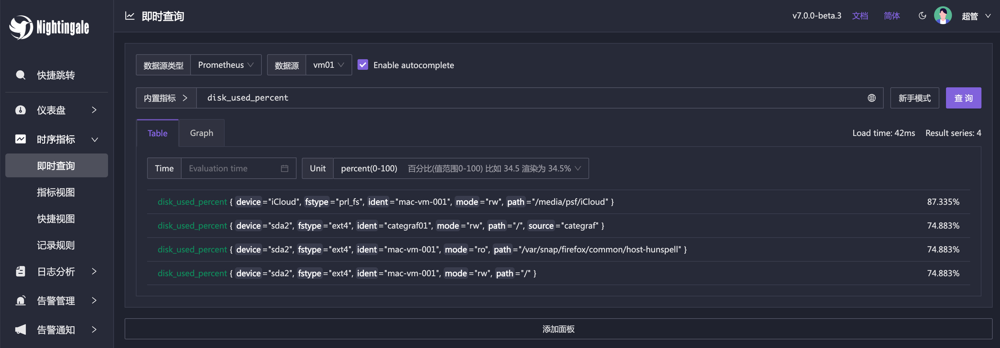

  

  <b>Open-source Alert Management Expert, an Integrated Observability Platform</b>

 

[English](./README_en.md) | [中文](./README.md)

## What is Nightingale

Nightingale is an open-source project focused on alerting. Similar to Grafana's data source integration approach, Nightingale also connects with various existing data sources. However, while Grafana focuses on visualization, Nightingale focuses on alerting engines.

Originally developed and open-sourced by Didi, Nightingale was donated to the China Computer Federation Open Source Development Committee (CCF ODC) on May 11, 2022, becoming the first open-source project accepted by the CCF ODC after its establishment. 

## Quick Start

- 👉 [Documentation](https://flashcat.cloud/docs/) | [Download](https://flashcat.cloud/download/nightingale/)
- ❤️ [Report a Bug](https://github.com/ccfos/nightingale/issues/new?assignees=&labels=&projects=&template=question.yml)
- ℹ️ For faster access, the above documentation and download sites are hosted on [FlashcatCloud](https://flashcat.cloud).

## Features

- **Integration with Multiple Time-Series Databases:** Supports integration with various time-series databases such as Prometheus, VictoriaMetrics, Thanos, Mimir, M3DB, and TDengine, enabling unified alert management.
- **Advanced Alerting Capabilities:** Comes with built-in support for multiple alerting rules, extensible to common notification channels. It also supports alert suppression, silencing, subscription, self-healing, and alert event management.
- **High-Performance Visualization Engine:** Offers various chart styles with numerous built-in dashboard templates and the ability to import Grafana templates. Ready to use with a business-friendly open-source license.
- **Support for Common Collectors:** Compatible with [Categraf](https://flashcat.cloud/product/categraf), Telegraf, Grafana-agent, Datadog-agent, and various exporters as collectors—there's no data that can't be monitored.
- **Seamless Integration with [Flashduty](https://flashcat.cloud/product/flashcat-duty/):** Enables alert aggregation, acknowledgment, escalation, scheduling, and IM integration, ensuring no alerts are missed, reducing unnecessary interruptions, and enhancing efficient collaboration.

## Screenshots

You can switch languages and themes in the top right corner. We now support English, Simplified Chinese, and Traditional Chinese. 

### Instant Query

Similar to the built-in query analysis page in Prometheus, Nightingale offers an ad-hoc query feature with UI enhancements. It also provides built-in PromQL metrics, allowing users unfamiliar with PromQL to quickly perform queries.

### Metric View

Alternatively, you can use the Metric View to access data. With this feature, Instant Query becomes less necessary, as it caters more to advanced users. Regular users can easily perform queries using the Metric View.

### Built-in Dashboards

Nightingale includes commonly used dashboards that can be imported and used directly. You can also import Grafana dashboards, although compatibility is limited to basic Grafana charts. If you’re accustomed to Grafana, it’s recommended to continue using it for visualization, with Nightingale serving as an alerting engine.

### Built-in Alert Rules

In addition to the built-in dashboards, Nightingale also comes with numerous alert rules that are ready to use out of the box.

## Architecture

In most community scenarios, Nightingale is primarily used as an alert engine, integrating with multiple time-series databases to unify alert rule management. Grafana remains the preferred tool for visualization. As an alert engine, the product architecture of Nightingale is as follows:

For certain edge data centers with poor network connectivity to the central Nightingale server, we offer a distributed deployment mode for the alert engine. In this mode, even if the network is disconnected, the alerting functionality remains unaffected.

## Communication Channels

- **Report Bugs:** It is highly recommended to submit issues via the [Nightingale GitHub Issue tracker](https://github.com/ccfos/nightingale/issues/new?assignees=&labels=kind%2Fbug&projects=&template=bug_report.yml).
- **Documentation:** For more information, we recommend thoroughly browsing the [Nightingale Documentation Site](https://flashcat.cloud/docs/content/flashcat-monitor/nightingale-v7/introduction/).

## Stargazers over time

## Community Co-Building

- ❇️ Please read the [Nightingale Open Source Project and Community Governance Draft](./doc/community-governance.md). We sincerely welcome every user, developer, company, and organization to use Nightingale, actively report bugs, submit feature requests, share best practices, and help build a professional and active open-source community.
-  ❤️ Nightingale Contributors

## License
- [Apache License V2.0](https://github.com/didi/nightingale/blob/main/LICENSE)
