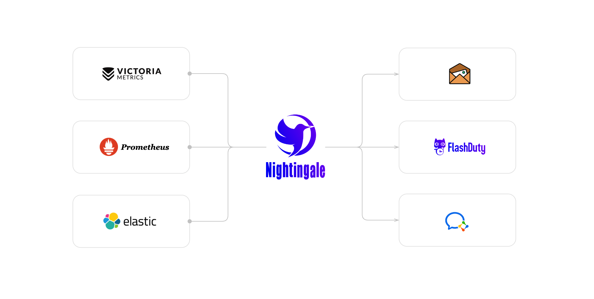
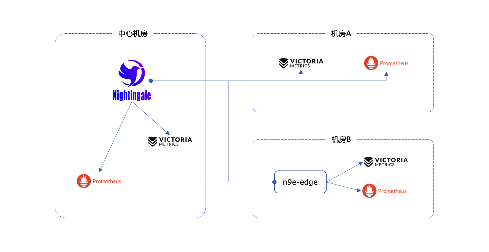

  

  <b>开源告警管理专家</b>

 

[English](./README.md) | [中文](./README_zh.md)

## 夜莺是什么

夜莺监控（Nightingale）是一款侧重告警的监控类开源项目。类似 Grafana 的数据源集成方式，夜莺也是对接多种既有的数据源，不过 Grafana 侧重在可视化，夜莺是侧重在告警引擎、告警事件的处理和分发。

夜莺监控项目，最初由滴滴开发和开源，并于 2022 年 5 月 11 日，捐赠予中国计算机学会开源发展委员会（CCF ODC），为 CCF ODC 成立后接受捐赠的第一个开源项目。

## 夜莺的工作逻辑

很多用户已经自行采集了指标、日志数据，此时就把存储库（VictoriaMetrics、ElasticSearch等）作为数据源接入夜莺，即可在夜莺里配置告警规则、通知规则，完成告警事件的生成和派发。

夜莺项目本身不提供监控数据采集能力。推荐您使用 [Categraf](https://github.com/flashcatcloud/categraf) 作为采集器，可以和夜莺丝滑对接。

[Categraf](https://github.com/flashcatcloud/categraf) 可以采集操作系统、网络设备、各类中间件、数据库的监控数据，通过 Remote Write 协议推送给夜莺，夜莺把监控数据转存到时序库（如 Prometheus、VictoriaMetrics 等），并提供告警和可视化能力。

对于个别边缘机房，如果和中心夜莺服务端网络链路不好，希望提升告警可用性，夜莺也提供边缘机房告警引擎下沉部署模式，这个模式下，即便边缘和中心端网络割裂，告警功能也不受影响。

> 上图中，机房A和中心机房的网络链路很好，所以直接由中心端的夜莺进程做告警引擎，机房B和中心机房的网络链路不好，所以在机房B部署了 `n9e-edge` 做告警引擎，对机房B的数据源做告警判定。

## 告警降噪、升级、协同

夜莺的侧重点是做告警引擎，即负责产生告警事件，并根据规则做灵活派发，内置支持 20 种通知媒介（电话、短信、邮件、钉钉、飞书、企微、Slack 等）。

如果您有更高级的需求，比如：

- 想要把公司的多套监控系统产生的事件聚拢到一个平台，统一做收敛降噪、响应处理、数据分析
- 想要支持人员的排班，践行 On-call 文化，想要支持告警认领、升级（避免遗漏）、协同处理

那夜莺是不合适的，推荐您选用 [FlashDuty](https://flashcat.cloud/product/flashcat-duty/) 这样的 On-call 产品，产品简单易用，也有免费套餐。

## 相关资料 & 交流渠道
- 📚 [夜莺介绍PPT](https://mp.weixin.qq.com/s/Mkwx_46xrltSq8NLqAIYow) 对您了解夜莺各项关键特性会有帮助（PPT链接在文末）
- 👉 [文档中心](https://flashcat.cloud/docs/) 为了更快的访问速度，站点托管在 [FlashcatCloud](https://flashcat.cloud)
- ❤️ [报告 Bug](https://github.com/ccfos/nightingale/issues/new?assignees=&labels=&projects=&template=question.yml) 写清楚问题描述、复现步骤、截图等信息，更容易得到答案
- 💡 前后端代码分离，前端代码仓库：[https://github.com/n9e/fe](https://github.com/n9e/fe)
- 🎯 关注[这个公众号](https://gitlink.org.cn/UlricQin)了解更多夜莺动态和知识
- 🌟 加我微信：`picobyte`（我已关闭好友验证）拉入微信群，备注：`夜莺互助群`，如果已经把夜莺上到生产环境，可联系我拉入资深监控用户群

## 关键特性简介

- 夜莺支持告警规则、屏蔽规则、订阅规则、通知规则，内置支持 20 种通知媒介，支持消息模板自定义
- 支持事件管道，对告警事件做 Pipeline 处理，方便和自有系统做自动化整合，比如给告警事件附加一些元信息，对事件做 relabel
- 支持业务组概念，引入权限体系，分门别类管理各类规则
- 很多数据库、中间件内置了告警规则，可以直接导入使用，也可以直接导入 Prometheus 的告警规则
- 支持告警自愈，即告警之后自动触发一个脚本执行一些预定义的逻辑，比如清理一下磁盘、抓一下现场等

- 夜莺存档了历史告警事件，支持多维度的查询和统计
- 支持灵活的聚合分组，一目了然看到公司的告警事件分布情况

- 夜莺内置常用操作系统、中间件、数据库的的指标说明、仪表盘、告警规则，不过都是社区贡献的，整体也是参差不齐
- 夜莺直接接收 Remote Write、OpenTSDB、Datadog、Falcon 等多种协议的数据，故而可以和各类 Agent 对接
- 夜莺支持 Prometheus、ElasticSearch、Loki、TDEngine 等多种数据源，可以对其中的数据做告警
- 夜莺可以很方便内嵌企业内部系统，比如 Grafana、CMDB 等，甚至可以配置这些内嵌系统的菜单可见性

- 夜莺支持仪表盘功能，支持常见的图表类型，也内置了一些仪表盘，上图是其中一个仪表盘的截图。
- 如果你已经习惯了 Grafana，建议仍然使用 Grafana 看图。Grafana 在看图方面道行更深。
- 机器相关的监控数据，如果是 Categraf 采集的，建议使用夜莺自带的仪表盘查看，因为 Categraf 的指标命名 Follow 的是 Telegraf 的命名方式，和 Node Exporter 不同
- 因为夜莺有个业务组的概念，机器可以归属不同的业务组，有时在仪表盘里只想查看当前所属业务组的机器，所以夜莺的仪表盘可以和业务组联动

## 广受关注

## 感谢众多企业的信赖

## 社区共建
- ❇️ 请阅读浏览[夜莺开源项目和社区治理架构草案](./doc/community-governance.md)，真诚欢迎每一位用户、开发者、公司以及组织，使用夜莺监控、积极反馈 Bug、提交功能需求、分享最佳实践，共建专业、活跃的夜莺开源社区。
- ❤️ 夜莺贡献者

## License
- [Apache License V2.0](https://github.com/didi/nightingale/blob/main/LICENSE)
