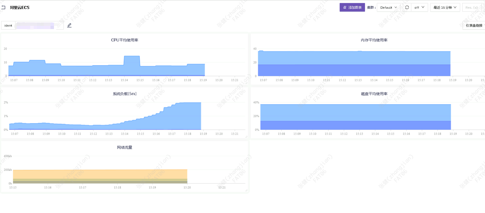
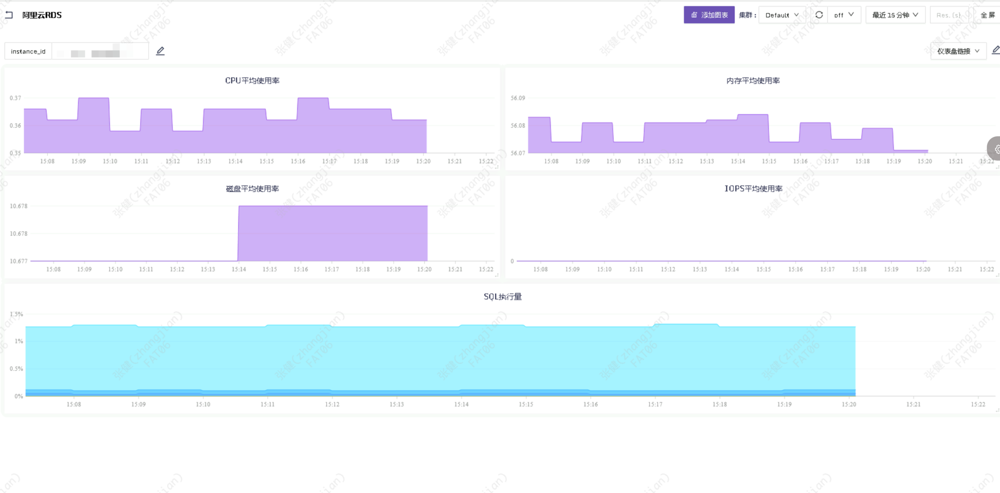
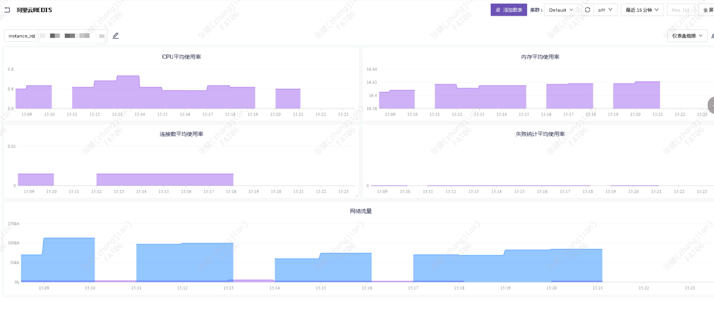
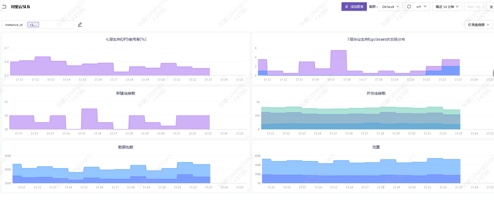
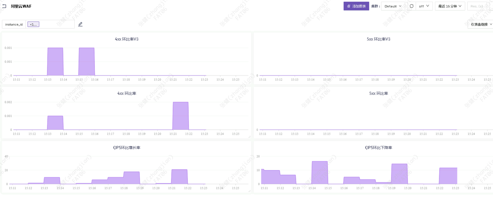

## AliYun Dashboard & Configurable

使用[categraf](https://github.com/flashcatcloud/categraf)中[input.aliyun](https://github.com/flashcatcloud/categraf/blob/main/conf/input.aliyun/cloud.toml)插件采集Vmware指标数据:

1. 在阿里云控制创建AK/SK，在IAM中赋予阿里云监控的权限；
2. 把创建好的AK/SK配置到Categraf的阿里云插件配置文件中。

### Categraf中conf/input.aliyun/cloud.toml配置文件：

```toml
# # categraf采集周期，阿里云指标的粒度一般是60秒，建议设置不要少于60秒
interval = 60
[[instances]]
## 阿里云资源所处的region
## endpoint region 参考 https://help.aliyun.com/document_detail/28616.html#section-72p-xhs-6qt
region="cn-beijing"
#endpoint="metrics.cn-hangzhou.aliyuncs.com"
endpoint="metrics.aliyuncs.com"
## 填入你的acces_key_id
access_key_id="admin"
## 填入你的access_key_secret
access_key_secret="admin"

## 可能无法获取当前最新指标，这个指标是指监控指标的截止时间距离现在多久
delay="2m"
## 阿里云指标的最小粒度，60s 是推荐值，再小了部分指标不支持
period="60s"
## 指标所属的namespace ,为空，则表示所有空间指标都要采集
## namespace 参考 https://help.aliyun.com/document_detail/163515.htm?spm=a2c4g.11186623.0.0.44d65c58mhgNw3
#namespaces=["waf"]
namespaces=["waf","acs_ecs_dashboard","acs_rds_dashboard","acs_slb_dashboard","acs_kvstore"]

# 阿里云查询指标接口的QPS是50， 这里默认设置为一半
ratelimit=25
# 查询指定namesapce指标后, namespace/metric_name等meta信息会缓存起来，catch_ttl 是指标的缓存时间
catch_ttl="1h"
# 每次请求阿里云endpoint的超时时间
timeout="5s"

## 过滤某个namespace下的一个或多个指标
## metric name 参考 https://help.aliyun.com/document_detail/163515.htm?spm=a2c4g.11186623.0.0.401d15c73Z0dZh
## 参考页面中的Metric Id 填入下面的metricName ,页面中包含中文的Metric Name对应接口中的Description
#[[instances.metric_filters]]
#namespace=""
#metric_names=["cpu_cores","vm.TcpCount", "cpu_idle"]
```

### 效果图










