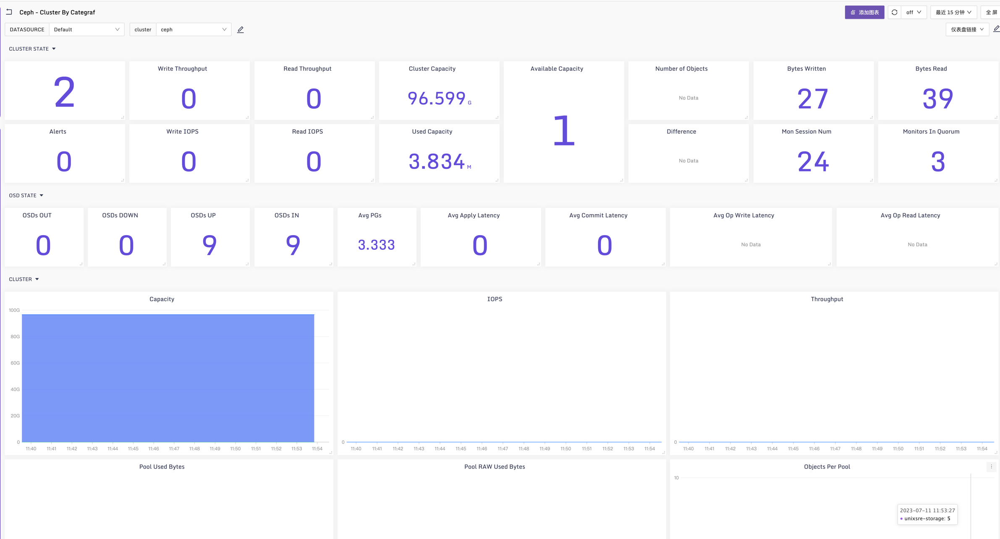
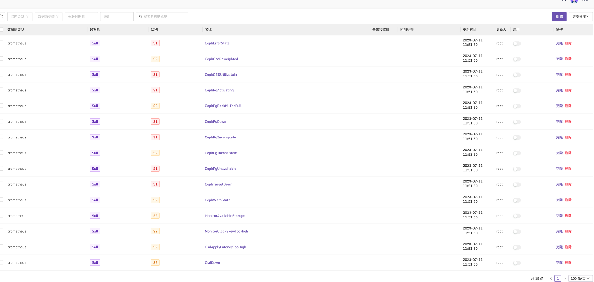

### Ceph Dashboard & Alerts
开启ceph 默认Prometheus支持
```bash
ceph mgr module enable prometheus
```

### 采集配置
在categraf中的prometheus插件中加入采集配置
```yaml
cat /opt/categraf/conf/input.prometheus/prometheus.toml
  [[instances]]
  urls = [
  "http://192.168.11.181:9283/metrics"
]
  url_label_key = "instance"
  url_label_value = "{{.Host}}"
  labels = {service="ceph",cluster="ceph"}
```


Dashboard:

[dashboard](../dashboards/ceph_by_categraf.json)



Alerts:

[alerts](../alerts/ceph_by_categraf.json)

