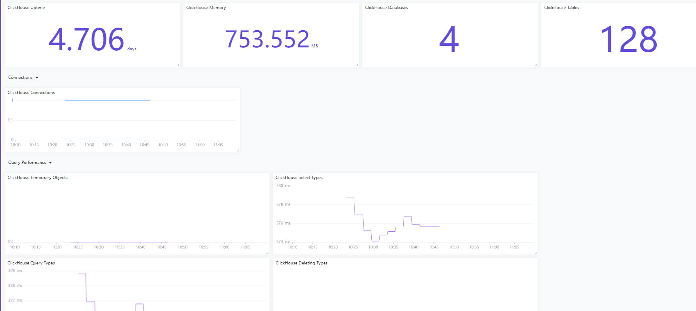

# ClickHouse Input Plugin

This plugin gathers the statistic data from
[ClickHouse](https://github.com/ClickHouse/ClickHouse) server.

## Global configuration options

In addition to the plugin-specific configuration settings, plugins support
additional global and plugin configuration settings. These settings are used to
modify metrics, tags, and field or create aliases and configure ordering, etc.
See the [CONFIGURATION.md][CONFIGURATION.md] for more details.

## Configuration
路径 categraf/conf/input.clickhouse


```toml
# # collect interval
# interval = 15

# Read metrics from one or many ClickHouse servers
[[instances]]
  ## Username for authorization on ClickHouse server
  username = "default"

  ## Password for authorization on ClickHouse server
  # password = ""

  ## HTTP(s) timeout while getting metrics values
  ## The timeout includes connection time, any redirects, and reading the
  ## response body.
  # timeout = 5

  ## List of servers for metrics scraping
  ## metrics scrape via HTTP(s) clickhouse interface
  ## https://clickhouse.tech/docs/en/interfaces/http/
  servers = ["http://127.0.0.1:8123"]

  ## If "auto_discovery"" is "true" plugin tries to connect to all servers
  ## available in the cluster with using same "user:password" described in
  ## "user" and "password" parameters and get this server hostname list from
  ## "system.clusters" table. See
  ## - https://clickhouse.tech/docs/en/operations/system_tables/#system-clusters
  ## - https://clickhouse.tech/docs/en/operations/server_settings/settings/#server_settings_remote_servers
  ## - https://clickhouse.tech/docs/en/operations/table_engines/distributed/
  ## - https://clickhouse.tech/docs/en/operations/table_engines/replication/#creating-replicated-tables
  # auto_discovery = true

  ## Filter cluster names in "system.clusters" when "auto_discovery" is "true"
  ## when this filter present then "WHERE cluster IN (...)" filter will apply
  ## please use only full cluster names here, regexp and glob filters is not
  ## allowed for "/etc/clickhouse-server/config.d/remote.xml"
  ## <yandex>
  ##  <remote_servers>
  ##    <my-own-cluster>
  ##        <shard>
  ##          <replica><host>clickhouse-ru-1.local</host><port>9000</port></replica>
  ##          <replica><host>clickhouse-ru-2.local</host><port>9000</port></replica>
  ##        </shard>
  ##        <shard>
  ##          <replica><host>clickhouse-eu-1.local</host><port>9000</port></replica>
  ##          <replica><host>clickhouse-eu-2.local</host><port>9000</port></replica>
  ##        </shard>
  ##    </my-onw-cluster>
  ##  </remote_servers>
  ##
  ## </yandex>
  ##
  ## example: cluster_include = ["my-own-cluster"]
  # cluster_include = []

  ## Filter cluster names in "system.clusters" when "auto_discovery" is
  ## "true" when this filter present then "WHERE cluster NOT IN (...)"
  ## filter will apply
  ##    example: cluster_exclude = ["my-internal-not-discovered-cluster"]
  # cluster_exclude = []

  ## Optional TLS Config
  # tls_ca = "/etc/telegraf/ca.pem"
  # tls_cert = "/etc/telegraf/cert.pem"
  # tls_key = "/etc/telegraf/key.pem"
  ## Use TLS but skip chain & host verification
  # insecure_skip_verify = false

```

## 监控大盘

夜莺提供了 clickhouse 相关的监控大盘，使用categraf作为采集器，方便查询监控


## 告警规则

夜莺提供了 clickhouse 相关的告警规则，可以自行配置通知方式用于自己的业务，同时欢迎继续完善