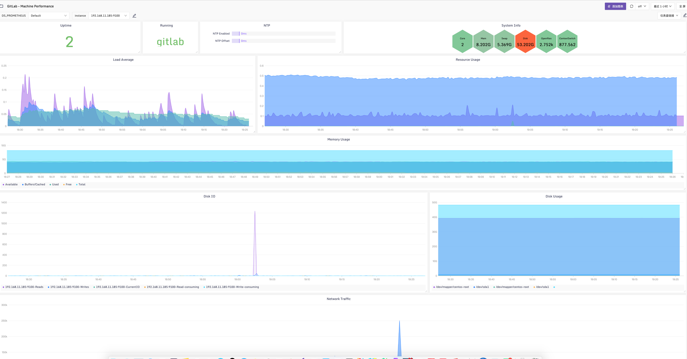
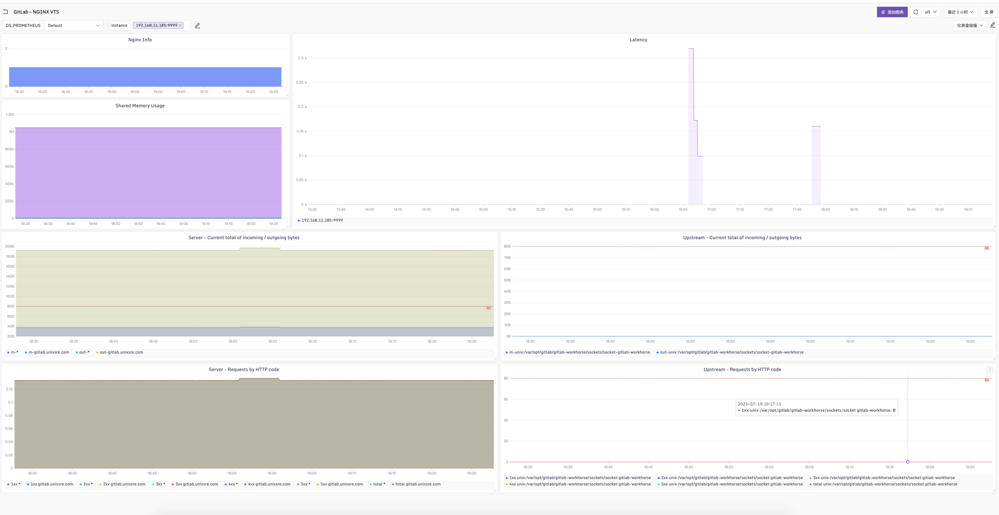
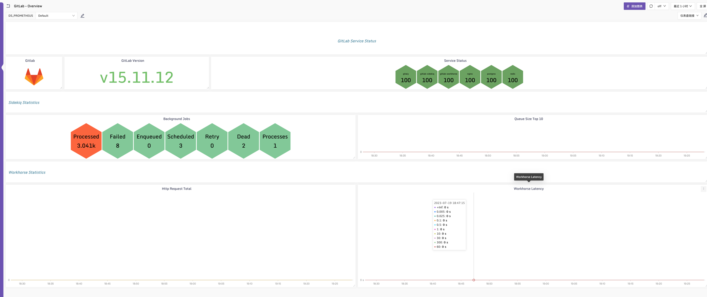
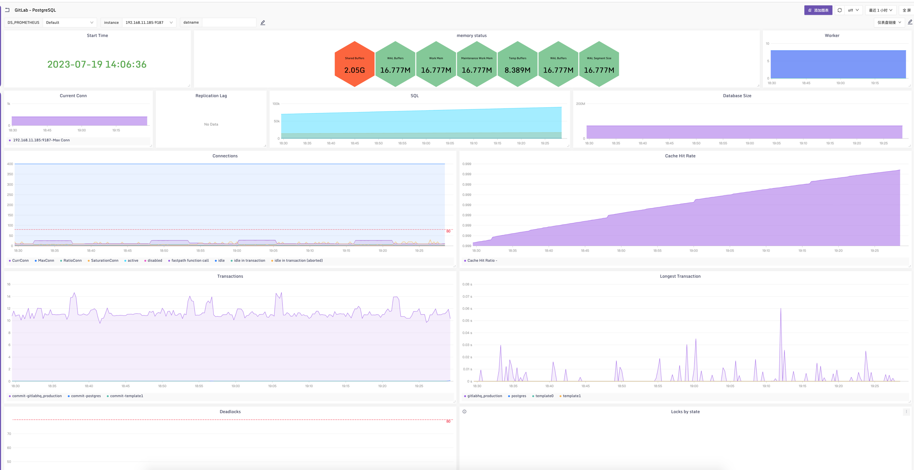
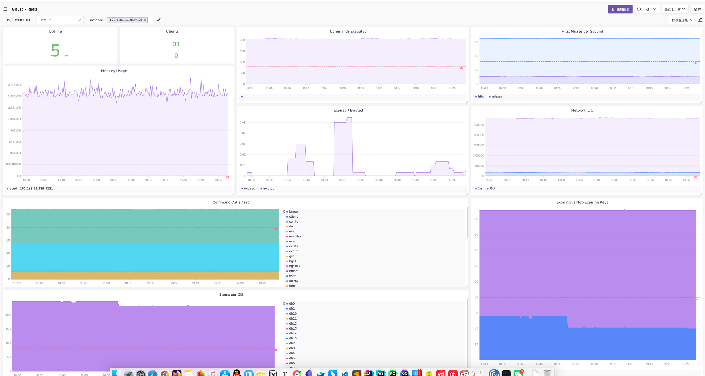
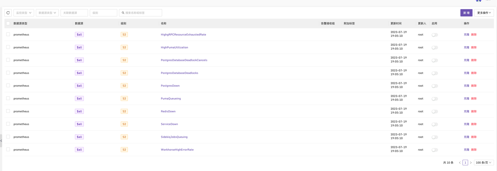

### Gitlab Dashboard & Alerts
使用[categraf](https://github.com/flashcatcloud/categraf)中[inputs.prometheus](https://github.com/flashcatcloud/categraf/tree/main/inputs/prometheus)插件采集[Gitlab](https://docs.gitlab.com/)服务组件暴露的指标数据:

开启Gitlab默认Prometheus支持:

[Monitoring GitLab with Prometheus](https://docs.gitlab.com/ee/administration/monitoring/prometheus/)

### 采集配置
在categraf中的prometheus插件中加入采集配置
```yaml
cat /opt/categraf/conf/input.prometheus/prometheus.toml
# # collect interval
# interval = 15

[[instances]]
urls = [
"http://192.168.11.77:9236/metrics"
]
url_label_key = "instance"
url_label_value = "{{.Host}}"
labels = {service="gitlab",job="gitaly"}

[[instances]]
urls = [
"http://192.168.11.77:9168/sidekiq"
]
url_label_key = "instance"
url_label_value = "{{.Host}}"
labels = {service="gitlab",job="gitlab_exporter_sidekiq"}


[[instances]]
urls = [
"http://192.168.11.77:9168/database"
]
url_label_key = "instance"
url_label_value = "{{.Host}}"
labels = {service="gitlab",job="gitlab_exporter_database"}

[[instances]]
urls = [
"http://192.168.11.77:8082/metrics"
]
url_label_key = "instance"
url_label_value = "{{.Host}}"
labels = {service="gitlab",job="gitlab-sidekiq"}

[[instances]]
urls = [
"http://192.168.11.77:8082/metrics"
]
url_label_key = "instance"
url_label_value = "{{.Host}}"
labels = {service="gitlab",job="gitlab-sidekiq"}

[[instances]]
urls = [
"http://192.168.11.77:9229/metrics"
]
url_label_key = "instance"
url_label_value = "{{.Host}}"
labels = {service="gitlab",job="gitlab-workhorse"}

[[instances]]
urls = [
"http://192.168.11.77:9100/metrics"
]
url_label_key = "instance"
url_label_value = "{{.Host}}"
labels = {service="gitlab",job="node"}


[[instances]]
urls = [
"http://192.168.11.77:9187/metrics"
]
url_label_key = "instance"
url_label_value = "{{.Host}}"
labels = {service="gitlab",job="postgres"}


[[instances]]
urls = [
"http://192.168.11.77:9121/metrics"
]
url_label_key = "instance"
url_label_value = "{{.Host}}"
labels = {service="gitlab",job="redis"}

[[instances]]
urls = [
"http://192.168.11.77:9999/metrics"
]
url_label_key = "instance"
url_label_value = "{{.Host}}"
labels = {service="gitlab",job="nginx"}
```


Dashboards:

[MachinePerformance](../dashboards/MachinePerformance.json)



[NGINXVTS](../dashboards/NGINXVTS.json)



[Overview](../dashboards/Overview.json)



[PostgreSQL](../dashboards/PostgreSQL.json)



[Redis](../dashboards/Redis.json)




Alerts:

[alerts](../alerts/gitlab_by_categraf.json)

