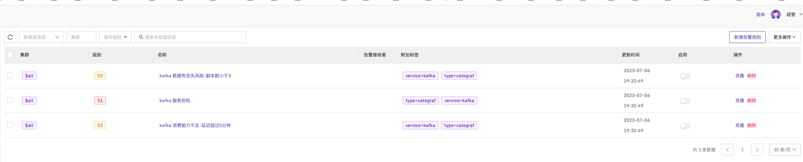
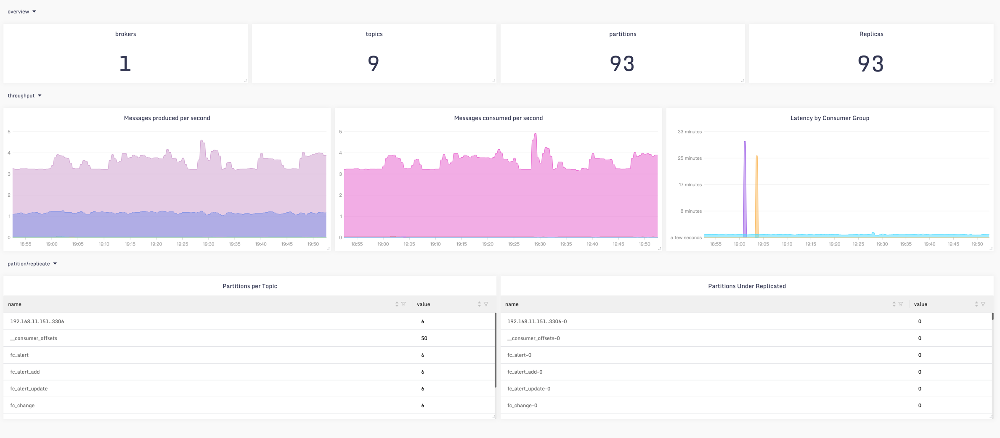

## VictoriaMetrics Dashboard & Alerts

使用[categraf](https://github.com/flashcatcloud/categraf)中[inputs.kafka](https://github.com/flashcatcloud/categraf/tree/main/inputs/kafka)插件采集[kafka](https://kafka.apache.org/)服务监控指标数据:

### 配置文件示例：

下面为配置示例，如果是多个kafka就可以写多个[[instances]];

```toml
[[instances]]
log_level = "error"
kafka_uris = ["192.168.0.250:9092"]
labels = { cluster="kafka-cluster", service="kafka" }
```

### 告警规则



[alerts](../alerts/kafka_by_categraf.json)

### 仪表盘：



[dashboard](../dashboards/kafka_by_categraf.json)
