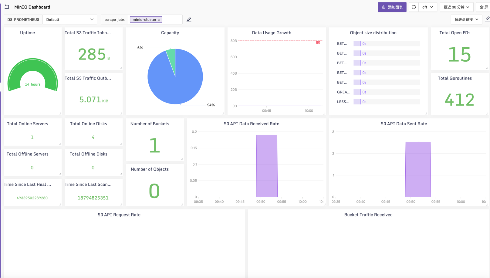
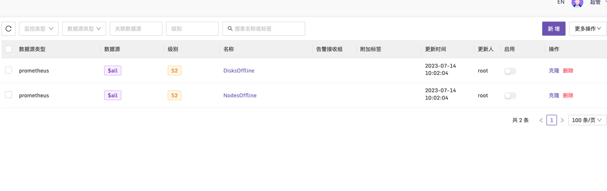

### MinIO Dashboard & Alerts

使用[categraf](https://github.com/flashcatcloud/categraf)中[inputs.prometheus](https://github.com/flashcatcloud/categraf/tree/main/inputs/prometheus)插件采集[MinIO](https://min.io/docs/minio/linux/operations/monitoring/collect-minio-metrics-using-prometheus.html?ref=docs-redirect#minio-metrics-collect-using-prometheus)服务指标数据:

开启 MinIO Prometheus访问；

```bash
# 启动MinIO服务的时候加入下面的变量：
MINIO_PROMETHEUS_AUTH_TYPE=public
```

### 采集配置
在categraf中的prometheus插件中加入采集配置
```yaml
cat /opt/categraf/conf/input.prometheus/prometheus.toml
[[instances]]
  urls = [
  "http://192.168.1.188:9000/minio/v2/metrics/cluster"
]
url_label_key = "instance"
url_label_value = "{{.Host}}"
labels = {job="minio-cluster"}
```

[Dashboard](../dashboards/minio_by_categraf.json)



[Alerts](../alerts/minio_by_categraf.json)

