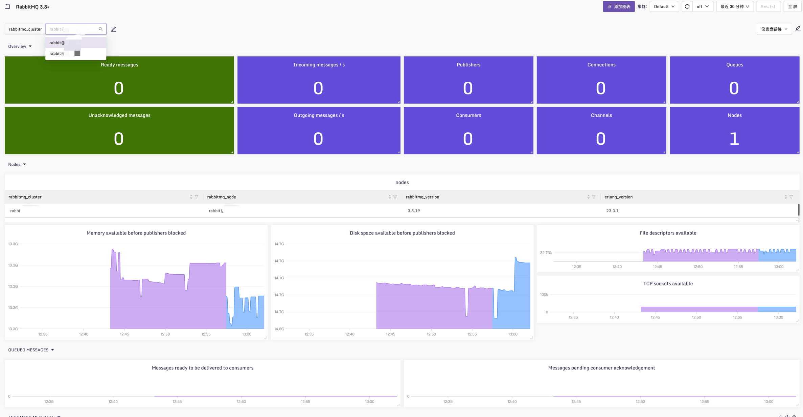

## RabbitMQ Dashboard & Configuration

使用[categraf](https://github.com/flashcatcloud/categraf)中[inputs.prometheus](https://github.com/flashcatcloud/categraf/tree/main/inputs/prometheus)插件采集[RabbitMQ](https://www.rabbitmq.com/)默认暴露的指标数据:


### 配置文件示例：

初始化好集群后，使用`rabbitmq-plugins enable rabbitmq_prometheus`命令开启集群默认暴露Prometheus指标，配置测试版本为3.8.19，理论上版本大于3.8+的版本都可以使用。

```toml
# conf/input.prometheus/prometheus.toml
[[instances]]
urls = [
    "http://192.168.x.11:15692/metrics",
    "http://192.168.x.12:15692/metrics"
]

url_label_key = "instance"
url_label_value = "{{.Host}}"
labels = {service="rabbitmq-cluster"}

```

### 告警规则

[alerts](../alerts/alerts.json)


### 效果图：

