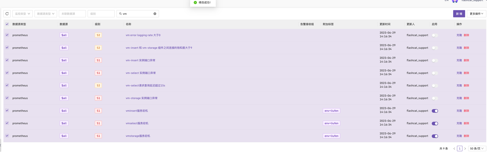
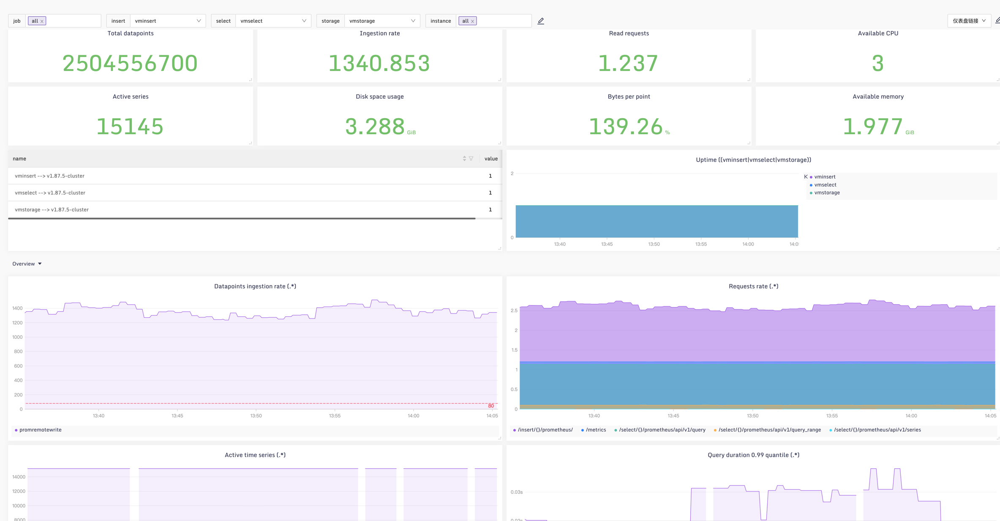

## VictoriaMetrics Dashboard & Alerts

使用[categraf](https://github.com/flashcatcloud/categraf)中[inputs.prometheus](https://github.com/flashcatcloud/categraf/tree/main/inputs/prometheus)插件采集[VictoriaMetrics](https://docs.victoriametrics.com/)三个服务组件默认暴露的指标数据:

写入模块： `vminsert` 端口：`8480` URI：`metrics`

查询模块： `vmselect` 端口：`8481` URI：`metrics`

存储模块： `vmstorage` 端口：`8482` URI：`metrics`

### 配置文件示例：

其中label_key: `instance` ，label: `service`  为[dashboard](../dashboard/victoriametrics.json)中选择变量，制作版本为v1.83.0，已经在1.90.0进行过验证，理论上适配当前1.70.0以上所有版本，指标描述全部补齐，并调整为中文，这个仪表盘为官方推荐的集群仪表盘，一直在持续更新，推荐使用这个；

```toml
# vmstorage
[[instances]]
urls = [
     "http://127.0.0.1:8482/metrics"
]
url_label_key = "instance"
url_label_value = "{{.Host}}"
labels = {service="vmstorage"}

# vmselect
[[instances]]
urls = [
     "http://127.0.0.1:8481/metrics"
]

url_label_key = "instance"
url_label_value = "{{.Host}}"
labels = {service="vmselect"}

# vminsert
[[instances]]
urls = [
     "http://127.0.0.1:8480/metrics"
]
url_label_key = "instance"
url_label_value = "{{.Host}}"
labels = {service="vminsert"}
```

### 告警规则



[alerts](../alerts/alerts.json)

### 仪表盘：



[dashboard](../dashboard/victoriametrics.json)
