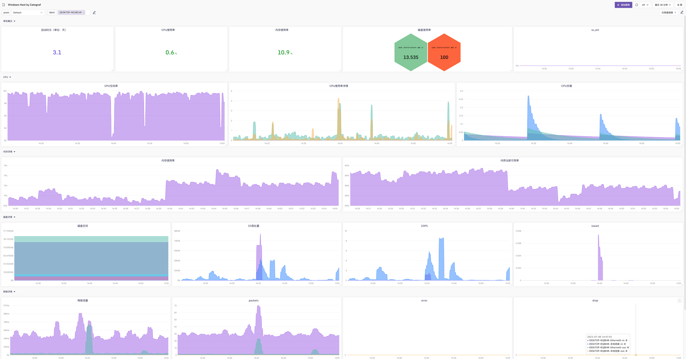

## Windows Dashboard & Alerts

使用[categraf](https://github.com/flashcatcloud/categraf)集Windows：win10/win2016基础监控指标数据:

[Categraf安装文档(搜索Windows关键字)](https://flashcat.cloud/docs/content/flashcat-monitor/categraf/2-installation/)

### Categraf中conf/config.toml配置文件：

因为Categraf采集的指标并不是像Telegraf采集Windows的指标有win前缀，在Categraf里是没有的，是直接与linux的基础系统指标合并在一起的，而且在Windows下有一些指标没有的，比如FD、内核态等等指标。

合并在一起的好处是可以不用采集过多的冗余指标，浪费空间，减轻了时序存储的压力。

如果有Linux、Windows共存的情况，为了使大盘可以区分属于哪个操作系统平台，我们使用全局标签来筛选即可。

Categraf的config.toml的简单配置，只需要修改3处即可；

`Windows配置`

```toml
...
# 此处label配置仅对Windows采集使用；
[global.labels]
platform="windows"
...
[[writers]]
url = "http://192.168.0.250:19000/prometheus/v1/write"
...
url = "http://192.168.0.250:19000/v1/n9e/heartbeat"
...
```

`Linux主机配置`

```toml
...
# 此处label配置仅对Linux采集使用；
[global.labels]
platform="linux"
...
[[writers]]
url = "http://192.168.0.250:19000/prometheus/v1/write"
...
url = "http://192.168.0.250:19000/v1/n9e/heartbeat"
...
```

**注意：此处大盘仅对Windows做了label条件筛选，如果是Linux，需要单独在选择变量中加入platform='linux'；如下：**

`label_values(system_load1{platform="linux"},ident)`

*如果不需要区分操作系统平台，也可以直接导入大盘使用*

### Windows效果图



### 仪表盘

[dashboard](../dashboards/windows_by_categraf.json)中选择变量，如果有特殊需求，可自行修改或者添加；

### 告警规则

[alerts](../alerts/windows_by_categraf.json)
