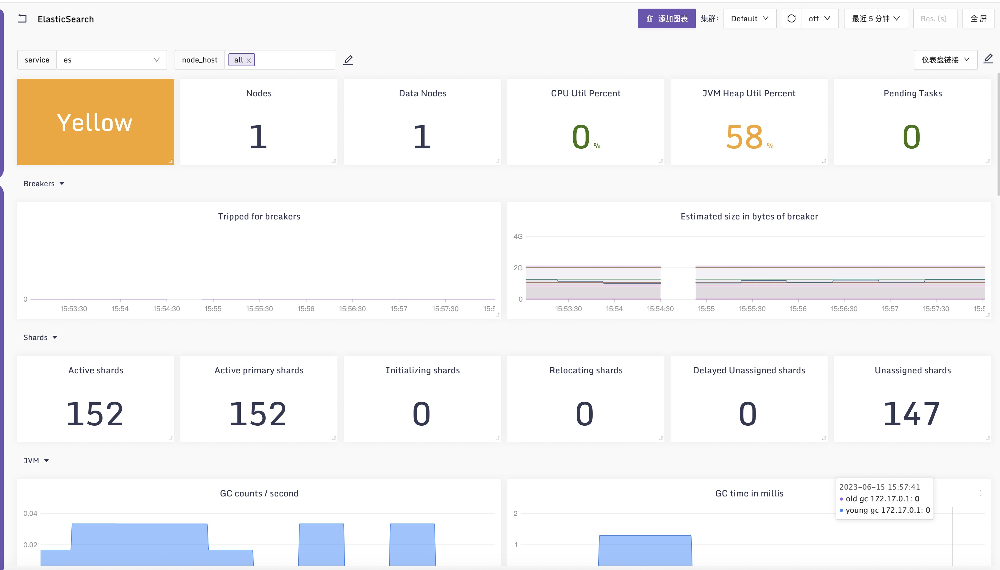

### 采集方式

使用Categraf插件[elasticsearch](https://github.com/flashcatcloud/categraf/blob/main/conf/input.elasticsearch/elasticsearch.toml)采集ES指标；

### 配置示例

```yaml
cat conf/input.elasticsearch/elasticsearch.toml | egrep -v "^#|^$"
[[instances]]
servers = ["http://192.168.11.177:9200"]
http_timeout = "5s"
local = true
cluster_health = true
cluster_health_level = "cluster"
cluster_stats = true
indices_level = ""
node_stats = ["jvm", "breaker", "process", "os", "fs", "indices"]
username = "elastic"
password = "xxxxxxxx"
num_most_recent_indices = 1
labels = { instance="default-es" , service="es" }
```

### 效果图：

