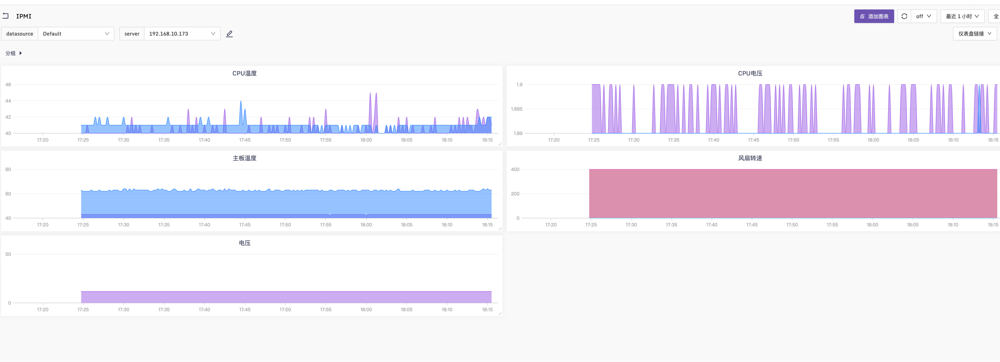

### 使用Categraf基于IPMI工具监控硬件温度、功率、电压

实现原理：

利用ipmitool sdr命令， 采集硬件的温度、功率、电压等信息，并转化为指标。 依赖工具ipmitool ,所以需要安装ipmitool。

IPMI配置：

```bash
#  此处的主机必须支持ipmi bmc，不然openipmi启动不了
# Ubuntu 
apt install openipmi ipmitool
# Centos
yum install OpenIPMI  ipmitool
# 加载模块
modprobe ipmi_msghandler
modprobe ipmi_devintf
modprobe ipmi_si
modprobe ipmi_poweroff
modprobe ipmi_watchdog
# 此处有一点一定要注意，如果不是真实的服务器的话，在加载ipmi_si的时候会报错，因为在虚拟化中使用虚拟机测试，安装完成以后，ipmi_si模块无法加载。
lsmod |grep ^ipmi
ipmi_watchdog          28672  0
ipmi_poweroff          16384  0
ipmi_ssif              32768  0
ipmi_si                61440  1
ipmi_devintf           20480  0
ipmi_msghandler       102400  5 ipmi_devintf,ipmi_si,ipmi_watchdog,ipmi_ssif,ipmi_poweroff
# 配置ipm访问，在目标主机，我这里是server01做实例。
ipmitool user list 1 # 查看当前的用户列表
ID  Name         Callin  Link Auth  IPMI Msg   Channel Priv Limit
1                    true    false      false      NO ACCESS
2   root             true    true       true       ADMINISTRATOR
3                    true    false      false      NO ACCESS
4                    true    false      false      NO ACCESS
5                    true    false      false      NO ACCESS
6                    true    false      false      NO ACCESS
7                    true    false      false      NO ACCESS
8                    true    false      false      NO ACCESS
9                    true    false      false      NO ACCESS
10                   true    false      false      NO ACCESS
# 设置ID 3 为 user为 test 密码 test
ipmitool  user  set name 3 test
ipmitool  user  set password 3 test
ipmitool  user  enable 3
# 验证
ipmitool user list 1 
ID  Name         Callin  Link Auth  IPMI Msg   Channel Priv Limit
1                    true    false      false      NO ACCESS
2   root             true    true       true       ADMINISTRATOR
3   test             true    false      false      NO ACCESS
4                    true    false      false      NO ACCESS
5                    true    false      false      NO ACCESS
6                    true    false      false      NO ACCESS
7                    true    false      false      NO ACCESS
8                    true    false      false      NO ACCESS
9                    true    false      false      NO ACCESS
10                   true    false      false      NO ACCESS
# privilege value：1 callback 2 user 3 operator 4 administrator 5 OEM
# 设置用户test权限 channel 为 1，user ID 为 3，privilege 为 4
ipmitool channel setaccess 1 3 callin=on ipmi=on link=on privilege=4
# 验证权限
ipmitool channel getaccess 1 3
Maximum User IDs     : 10
Enabled User IDs     : 1

User ID              : 3
User Name            : test
Fixed Name           : No
Access Available     : call-in / callback
Link Authentication  : enabled
IPMI Messaging       : enabled
Privilege Level      : ADMINISTRATOR
Enable Status        : disabled
ipmitool  user list 1
# 再次使用ipmitool  user list 1验证
ipmitool  user list 1
ID  Name         Callin  Link Auth  IPMI Msg   Channel Priv Limit
1                    true    false      false      NO ACCESS
2   root             true    true       true       ADMINISTRATOR
3   test             true    true       true       ADMINISTRATOR
4                    true    false      false      NO ACCESS
5                    true    false      false      NO ACCESS
6                    true    false      false      NO ACCESS
7                    true    false      false      NO ACCESS
8                    true    false      false      NO ACCESS
9                    true    false      false      NO ACCESS
10                   true    false      false      NO ACCESS
# OK，针对网络做下配置，注意主机的网段与子网掩码
ipmitool lan set 1 ipaddr 192.168.1.229
ipmitool lan set 1 netmask 255.255.252.0
ipmitool lan set 1 defgw ipaddr 192.168.1.123
ipmitool lan set 1 access on
# 验证网络配置
ipmitool lan print 1
IP Address Source       : Static Address
IP Address              : 192.168.1.227
Subnet Mask             : 255.255.252.0
MAC Address             : xx:xx:52:xx:xx:81
SNMP Community String   : public
```

### 采集配置
使用[categraf](https://github.com/flashcatcloud/categraf)中[inputs.ipmi](https://github.com/flashcatcloud/categraf/tree/main/inputs/ipmi)插件采集服务器指标:
```yaml
cat /opt/categraf/conf/input.ipmi/conf.toml
  [[instances]]
  ## optionally specify the path to the ipmitool executable
  # path = "/usr/bin/ipmitool"
  ##
  ## Setting 'use_sudo' to true will make use of sudo to run ipmitool.
  ## Sudo must be configured to allow the telegraf user to run ipmitool
  ## without a password.
  # use_sudo = false
  ##
  ## optionally force session privilege level. Can be CALLBACK, USER, OPERATOR, ADMINISTRATOR
  # privilege = "ADMINISTRATOR"
  ##
  ## optionally specify one or more servers via a url matching
  ##  [username[:password]@][protocol[(address)]]
  ##  e.g.
  ##    root:passwd@lan(127.0.0.1)
  ##
  ## if no servers are specified, local machine sensor stats will be queried
  ##
  servers = ["ADMIN:1234567@lan(192.168.1.123)"]

  ## Recommended: use metric 'interval' that is a multiple of 'timeout' to avoid
  ## gaps or overlap in pulled data
  interval = "30s"

  ## Timeout for the ipmitool command to complete. Default is 20 seconds.
  timeout = "20s"

  ## Schema Version: (Optional, defaults to version 1)
  metric_version = 2

  ## Optionally provide the hex key for the IMPI connection.
  # hex_key = ""

  ## If ipmitool should use a cache
  ## for me ipmitool runs about 2 to 10 times faster with cache enabled on HP G10 servers (when using ubuntu20.04)
  ## the cache file may not work well for you if some sensors come up late
  # use_cache = false

  ## Path to the ipmitools cache file (defaults to OS temp dir)
  ## The provided path must exist and must be writable
```

[告警规则](../alerts/alerts.json)

效果图：