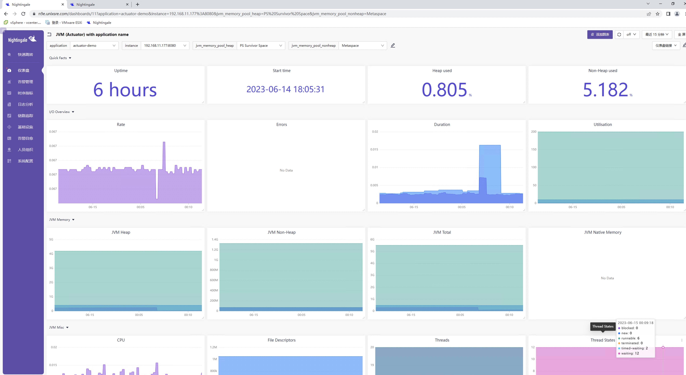

### SpringBoot生态使用自带的Actuator暴露指标
下载验证：
1. 在start.spring.io网站，在右侧将Spring Web、SpringBoot Actuator及Prometheus依赖加进去，直接就可以生成一个demo项目。
2. 点击下方的GENERATE下载到本地。
3. 修改`application.properties`文件，将`server.tomcat.mbeanregistry.enabled=true`添加进去。
4. 简单写个Controller后运行该项目。
5. 访问 `http://localhost:8080/actuator` 即可获取到所有的参数以及指标；

### 采集配置
在categraf中的prometheus插件中加入采集配置
```yaml
cat /opt/categraf/conf/input.prometheus/prometheus.toml
[[instances]]
urls = [
     "http://192.168.11.177:8080/actuator/prometheus"
]
url_label_key = "instance"
url_label_value = "{{.Host}}"
```

效果图：